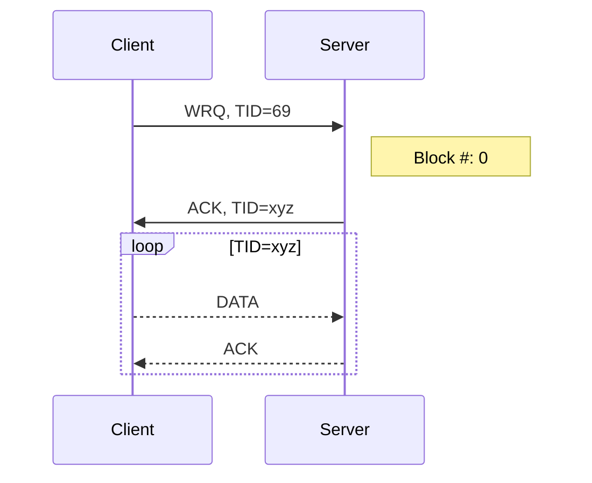

# TFTP packet parser in Rust

Based on [rfc 1350](https://datatracker.ietf.org/doc/html/rfc1350).

This is a simple library that parses tftp byte packets. See the [docs] for more information.

## The tftp packet

### WRQ/RRQ

| Opcode                | Filename           | 0           | Mode                | 0           |
| --------------------- | ------------------ | ----------- | ------------------- | ----------- |
| 2 bytes               | string             | 1 byte      | string              | 1 byte      |
| `01` or `02` as `u16` | `"file"` as `[u8]` | `0` as `u8` | `"octet"` as `[u8]` | `0` as `u8` |

### DATA

| Opcode        | Block #        | Data                 |
| ------------- | -------------- | -------------------- |
| 2 bytes       | 2 bytes        | 0 - 512 bytes        |
| `03` as `u16` | 1 - x as `u16` | Data Chunk as `[u8]` |

- **Block #**: Increments with each block sent
- **Data**: Transmission terminates automatically if Packet length < 512

### ACK

| Opcode        | Block #        |
| ------------- | -------------- |
| 2 bytes       | 2 bytes        |
| `04` as `u16` | 1 - x as `u16` |

### ERROR

| Opcode        | Error Code   | Error Message     | 0          |
| ------------- | ------------ | ----------------- | ---------- |
| 2 bytes       | 2 bytes      | string            | 1 byte     |
| `05` as `u16` | `x` as `u16` | `"msg"` as `[u8]` | `0`as `u8` |

## Protocol

### WRQ

